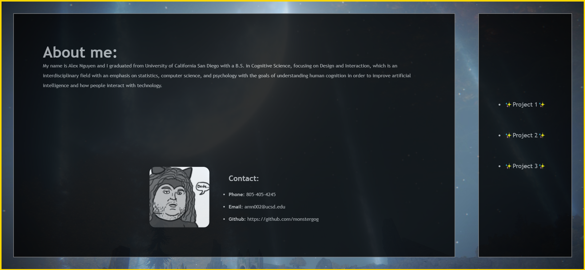

# <AlexNguyenPortfolio>

## Description
A portfolio created to showcase projects that I have worked on for reference.

## Installation

Once the repo has been downloaded, you can run the react client with `npm run start`.

## Usage

https://github.com/monstergog/React-Portfolio

Open the webpage and you can read about me and find my contact information. If you wish to view projects that I have worked on, you can navigate to their links and screenshots by clicking on one of the projects marked with ✨.

## License

N/A

---